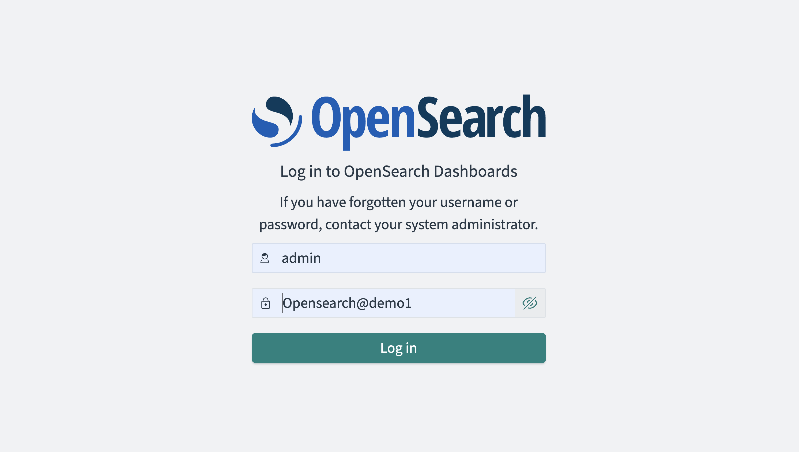
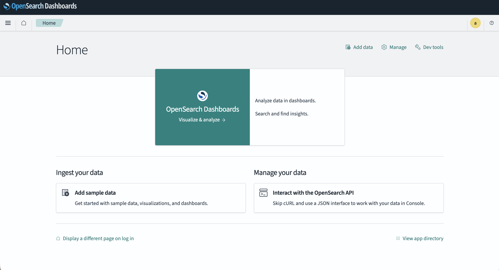

OpenSearch Easy Install
=======================
This demo is to install OpenSearch, an open-source, all-in-one vector database for building scalable and future-proof AI apps.
It delivers a ready to use installation with vectore database and visual dashboards. The installation scripts check for and validate
prerequisites automatically.

Install in a container (Podman)
-------------------------------
This is an installation using the provided Fluent Bit container image. You will
run this container on a virtual machine provided by Podman.

**Prerequisites:** Podman 4.x+ with your podman machine started.

1. [Download and unzip this demo.](https://gitlab.com/o11y-workshops/opensearch-install-demo/-/archive/v1.0/opensearch-install-demo-v1.0.zip)

2. Run 'init.sh' with the correct argument from the project root directory: 

``` 
   $ podman machine init
   $ ./init.sh podman
```

3. The OpenSearch and OpenSearch Dashboard ontainers are now running, connect:

```
   $ podman attach opensearch

   $ podamn attach osd
```

4. OpenSearch backend can be found at the following URL and when accessed via browser should give
   something like the following output:

```
   http://localhost:9200

    {
      "name" : "d80111d2fce1",
      "cluster_name" : "docker-cluster",
      "cluster_uuid" : "O76Ue_dETgaiAF_Kj3XtXQ",
      "version" : {
        "distribution" : "opensearch",
        "number" : "3.3.1",
        "build_type" : "tar",
        "build_hash" : "d90ecec16cb1049b762ed7c94777f42fb97b1eea",
        "build_date" : "2025-10-18T02:20:16.943324974Z",
        "build_snapshot" : false,
        "lucene_version" : "10.3.1",
        "minimum_wire_compatibility_version" : "2.19.0",
        "minimum_index_compatibility_version" : "2.0.0"
      },
      "tagline" : "The OpenSearch Project: https://opensearch.org/"
    }
```

5. OpenSearch dashboard UI can be found at the following URL and accesses with
   the default user and password (admin:OpenSearch@demo1):

```
    http://localhost:5601/app/home
```




Notes:
-----
If for any reason the installation breaks or you want a new OpenSearch installation, just rerun the installation script to
reinstall the containers.


Supporting Articles
-------------------
- [Coming soon...]


Released versions
-----------------
See the tagged releases for the following versions of the product:

- v1.0 - Supporting OpenSearch v3.3.1, OpenSearch Dashboards v3.3.0, installing in a container.

