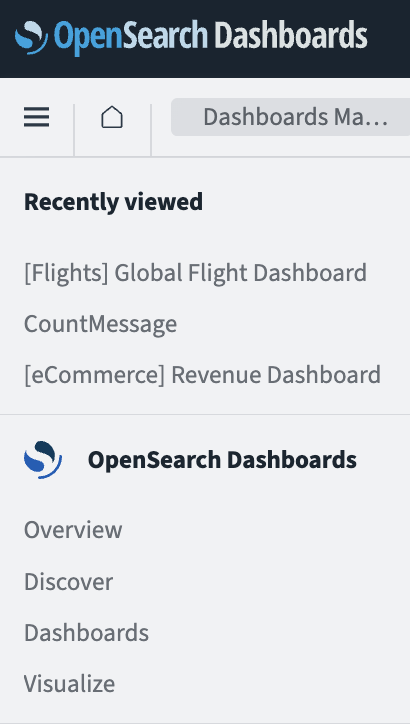
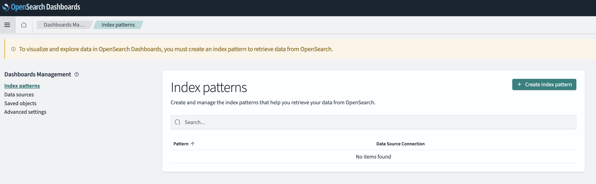
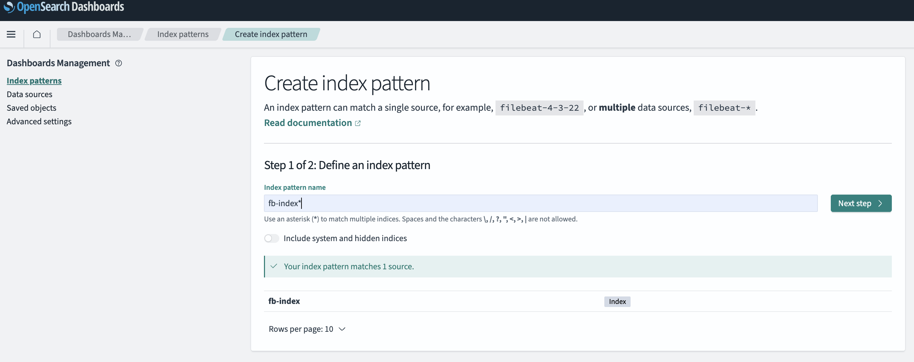
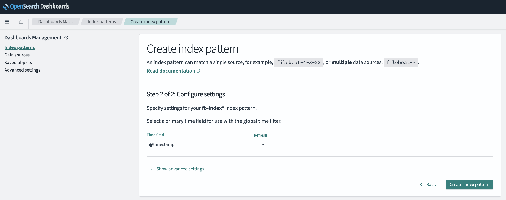
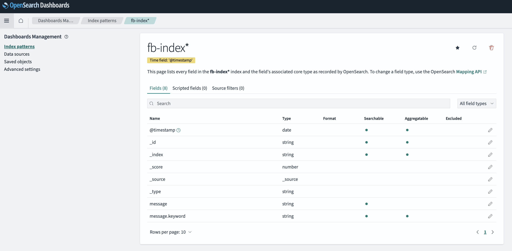
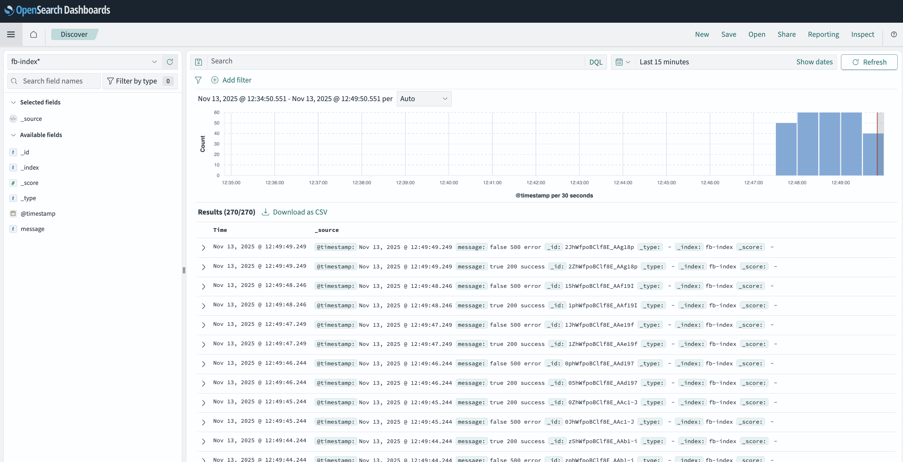

OpenSearch Easy Install
=======================
This demo is to install OpenSearch, an open-source, all-in-one vector database for building scalable and future-proof AI apps.
It delivers a ready to use installation with vectore database and visual dashboards. The installation scripts check for and validate
prerequisites automatically.

Explore how this all works in the free [hands-on workshop](https://o11y-workshops.gitlab.io/workshop-fluentbit).

Install in a container (Podman)
-------------------------------
This is an installation using the provided Fluent Bit container image. You will
run this container on a virtual machine provided by Podman.

**Prerequisites:** Podman 5.x+ with your podman machine started.

1. [Download and unzip this demo.](https://gitlab.com/o11y-workshops/opensearch-install-demo/-/archive/v1.0/opensearch-install-demo-v1.0.zip)

2. Run 'init.sh' with the correct argument from the project root directory: 

``` 
   $ podman machine init
   $ ./init.sh podman
```

3. The OpenSearch and OpenSearch Dashboard ontainers are now running, connect:

```
   $ podman attach opensearch

   $ podamn attach osd
```

4. OpenSearch backend can be found at the following URL and when accessed via browser should give
   something like the following output:

```
   http://localhost:9200

    {
      "name" : "d80111d2fce1",
      "cluster_name" : "docker-cluster",
      "cluster_uuid" : "O76Ue_dETgaiAF_Kj3XtXQ",
      "version" : {
        "distribution" : "opensearch",
        "number" : "3.3.1",
        "build_type" : "tar",
        "build_hash" : "d90ecec16cb1049b762ed7c94777f42fb97b1eea",
        "build_date" : "2025-10-18T02:20:16.943324974Z",
        "build_snapshot" : false,
        "lucene_version" : "10.3.1",
        "minimum_wire_compatibility_version" : "2.19.0",
        "minimum_index_compatibility_version" : "2.0.0"
      },
      "tagline" : "The OpenSearch Project: https://opensearch.org/"
    }
```

5. OpenSearch Dashboard UI can be found at the following URL and accesses with
   the default user and password (admin:OpenSearch@demo1):

```
    http://localhost:5601/app/home
```
 

6. After logging in to the OpenSearch Dashboard UI, it should look something
   like this:


7. Build a Fluent Bit image and run as follows:

```
    $ podman build -t opensearch:fb-opensearch -f support/Buildfile

    STEP 1/3: FROM ghcr.io/fluent/fluent-bit:4.2.0
    STEP 2/3: COPY ./fluent-bit.yaml /fluent-bit/etc/fluent-bit.yaml
    --> Using cache acb51a00c5a8c42a9001e5d6107544b7029a00d1e9546889e9c8fbddc0c467cf
    STEP 3/3: CMD [ "fluent-bit", "-c", "/fluent-bit/etc/fluent-bit.yaml"]
    --> Using cache b22b4e15da953a3568d6b6866c0741d077ac2abfe10b35632c72059f194e53de
    COMMIT opensearch:fb-opensearch
    Successfully tagged localhost/opensearch:fb-opensearch
    b22b4e15da953a3568d6b6866c0741d077ac2abfe10b35632c72059f194e53de

    
    $ podman run --rm --name fbOS --network os-net opensearch:fb-opensearch

    ...
    [2025/11/13 17:53:27.609803213] [ info] [input:dummy:dummy.0] initializing
    [2025/11/13 17:53:27.609808505] [ info] [input:dummy:dummy.0] storage_strategy='memory' (memory only)
    [2025/11/13 17:53:27.609831921] [ info] [input:dummy:dummy.1] initializing
    [2025/11/13 17:53:27.609836963] [ info] [input:dummy:dummy.1] storage_strategy='memory' (memory only)
    [2025/11/13 17:53:27.609938587] [ info] [output:stdout:stdout.0] worker #0 started
    [2025/11/13 17:53:27.610348253] [ info] [http_server] listen iface=0.0.0.0 tcp_port=2020
    [2025/11/13 17:53:27.610356586] [ info] [sp] stream processor started
    [2025/11/13 17:53:27.616956898] [ info] [engine] Shutdown Grace Period=5, Shutdown Input Grace Period=2
    {"date":"2025-11-13 17:53:28.245085","message":"true 200 success"}
    {"date":"2025-11-13 17:53:28.245159","message":"false 500 error"}
    {"date":"2025-11-13 17:53:29.246148","message":"true 200 success"}
    {"date":"2025-11-13 17:53:29.246251","message":"false 500 error"}
    ...
```

8. Now go to the OpenSearch Dashboard at http://localhost:5601 and using top
   left drop down menu, select DISCOVER:



9. The first step is to create an index on the telemetry data we are collecting,
   so click on the top right green  +CREATE INDEX PATTERN button:



10. In the field called INDEX PATTERN NAME we need to search for our __fb-index*__ 
    and click on the NEXT button as shown:



11. The second step is to use the drop-down menu to select the __@timestamp__
    field and click on the bottom right green button CREATE INDEX PATTERN as
    shown: 



12. This will display the new index we have created as follows:



13. Finally, to view our Fluent Bit telemetry data being ingested into
    OpenSearch, go back to the main menu on the top right and again select
    DISCOVER to view the resulting dashboard:



14. To stop all containers in this demo:

```
    $ podman build -t opensearch:fb-opensearch -f support/Buildfile

 

Notes:
-----
If for any reason the installation breaks or you want a new OpenSearch installation, just rerun the installation script to
reinstall the containers.


Supporting Articles
-------------------
- [Coming soon...]


Released versions
-----------------
See the tagged releases for the following versions of the product:

- v1.0 - Supporting OpenSearch v3.3.1 and OpenSearch Dashboards v3.3.0 installed in containers, integrating with Fluent Bit 4.2.0.

